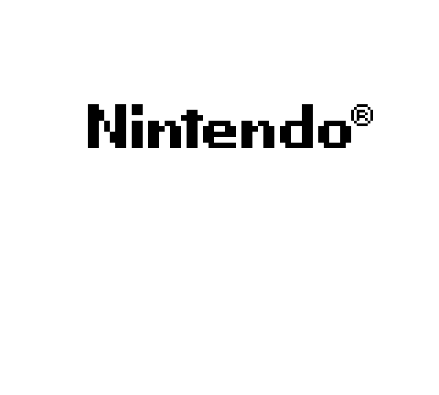

# Rust GameBoy

<table><tr>
<td>  </td>
<td>  </td>
</tr></table>

## Description

*!work in progress!*

Rust Gameboy is a open source Game Boy (GB) written in rust. It has a minibf front end.

## Features

### Implemented 

- cpu
- interupts
- joypad
- lcd controller
- cartridges with Mbc1, Mbc2, Mbc3

### Not Implemented

- sound
- Game Boy color features
- choice of palette
- automatic blargg tests for CI

Note that the cpu and interups blaggs tests pass on this emulator when tested manually.

## Controls

```
Z           - A
X           - B
ENTER       - start
BACKSPACE   - select
UP          - UP
DOWN        - DOWN
RIGHT       - RIGHT
LEFT        - LEFT
```

## How to Run

The crate `rust-gameboy` contains the gameboy. It can be run as follow. 
```bash
cargo run --bin rust-gameboy <file.gb>
```

The carte `codegenerator` is used to generate the CPU code from a json file. It does not need to be run for playing the GameBoy. If you want to run it, perform as follow:
```bash
cargo run --bin codegenerator
```


## Source

GameBoy manual: http://marc.rawer.de/Gameboy/Docs/GBCPUman.pdf

opcodes.json: https://gbdev.io/gb-opcodes//optables/

GameBoy wiki: https://gbdev.gg8.se/wiki/articles/Main_Page